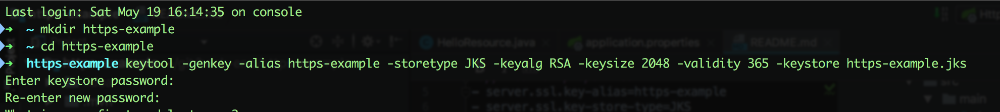
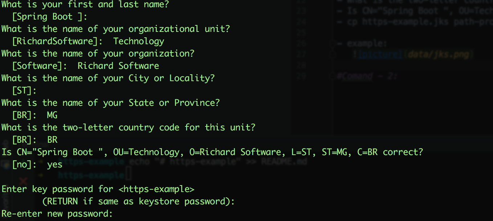
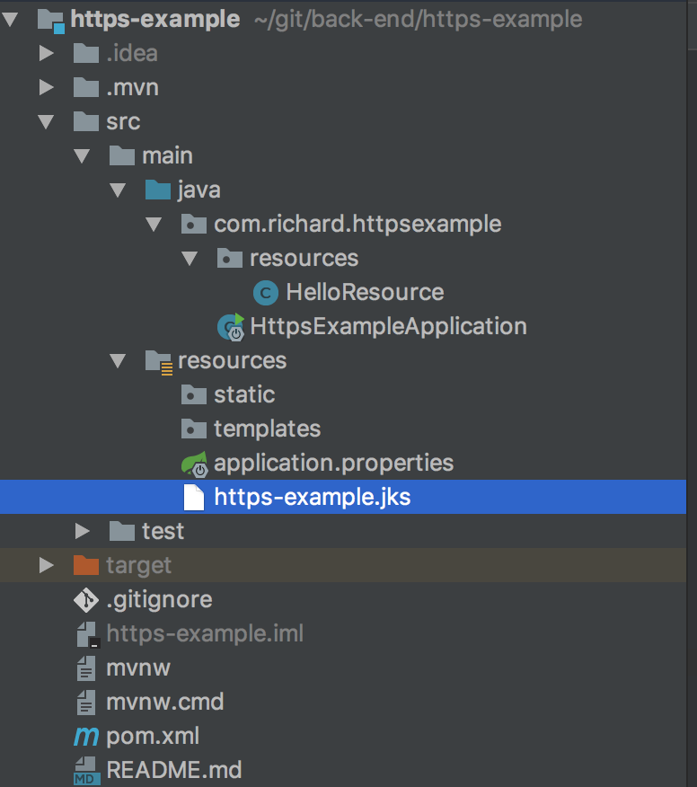
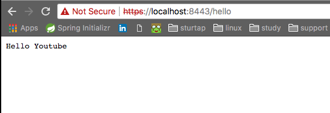
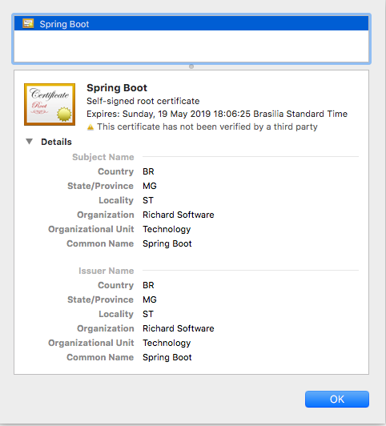

# https-example

#application.properties
- server.ssl.key-alias=https-example
- server.ssl.key-store-type=JKS
- server.ssl.key-password=password
- server.ssl.key-store=classpath:https-example.jks

#Comand - 1: 
`keytool -genkey -alias https-example -storetype JKS -keyalg RSA -keysize 2048 -validity 365 -keystore https-example.jks`

Out - insert password.

- Enter keystore password: ******
- Re-enter new password: ******
- What is your first and last name? `Spring Boot`
- What is the name of your organizational unit? `Technology`
- What is the name of your organization? `Richard Software`
- What is the name of your City or Locality? `ST`
- What is the name of your State or Province? `MG`
- What is the two-letter country code for this unit? `BR`
- Is CN="Spring Boot ", OU=Technology, O=Richard Software, L=ST, ST=MG, C=BR correct? `[no]:  yes`

- cp https-example.jks path-project/src/main/resources
-example:
   
   
#test browser

#certification

